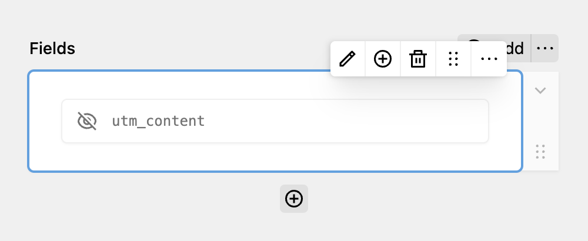

The hidden field allows you to access and store values from the URL parameters. Some common examples might be `ref` or `utm_content`. You can specify the respective key you want to capture.

It maps to an `<input type="hidden">` element.



In some instances, applying URL parameters as values might not work correctly due to caching. By default, Kirby should ignore the pages cache when an URL parameter is specified, but this is e.g. not the case for Staticache. If you encounter this issue, you can add a simple JavaScript that fills the inputs on the client-side.

```javascript
// Split the URL parameters into key-value pairs
const params = new URLSearchParams(window.location.search.substring(1));

// Loop through each key-value pair
for (const [key, value] of params) {
  // Find the input field with the matching name
  const input = document.querySelector(`input[type="hidden"][name="${key}"]`);

  // If the input field exists, set its value
  if (input) {
    input.value = value;
  }
}
```