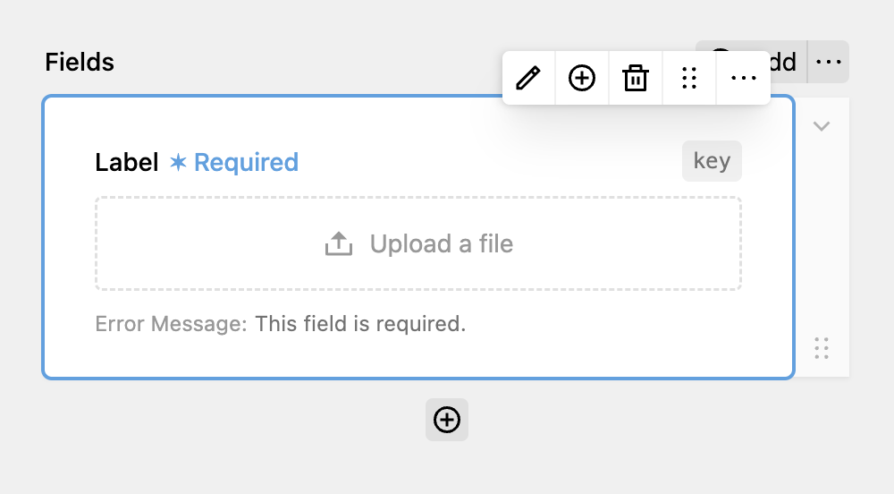

The File Upload allows your user to upload files like images, PDF documents, or archives with a form submission.



Clicking on the Edit button, you can customize the maximum file size and the allowed document types.

PHP has a maximum file size in the `php.ini` config that will take preference over the specified file size in the fields config. To increase it, set the `upload_max_filesize` & `post_max_size` to your desired values.

It's important to keep in mind that the **file upload is not available when disabling storing submisisons.**

## Protecting files

Since Kirby copies all files to the media folder, **they're publicly accessible by default.** If you're handling sensitive data, follow along. The Kirby documentation has great [Cookbook guide](https://getkirby.com/docs/cookbook/security/files-firewall) on how to protect files. You can adapt it to work with DreamForm files by checking for the `dreamform-upload` blueprint. In the end, it could look lke this:

```php
<?php

use Kirby\Toolkit\Str;
use Kirby\Uuid\Uuid;
use Kirby\Cms\App;

App::plugin('dreamform/files-firewall', [
  'routes' => [
    [
      'pattern' => '_form/(:any)',
      'action'  => function ($filename) {
        if (
          kirby()->user() &&
          $file = Uuid::for("file://{$filename}")?->model()
        ) {
          /** @var \Kirby\Cms\File $file */
          return $file->download();
        }

        return site()->errorPage();
      },
    ],
  ],
  'components' => [
    'file::url' => function ($kirby, $file) {
      if ($file->template() === 'dreamform-upload') {
        return $kirby->url() . '/_form/' . Str::replace($file->uuid()->toString(), 'file://', '');
      }

      return $file->mediaUrl();
    },
    'file::version' => function ($kirby, $file, array $options = []) {
      static $original;

      // if the file is protected, return the original file
      if ($file->template() === 'dreamform-upload') {
        return $file;
      }

      // if static $original is null, get the original component
      if ($original === null) {
        $original = $kirby->nativeComponent('file::version');
      }

      // and return it with the given options
      return $original($kirby, $file, $options);
    }
  ],
]);
```