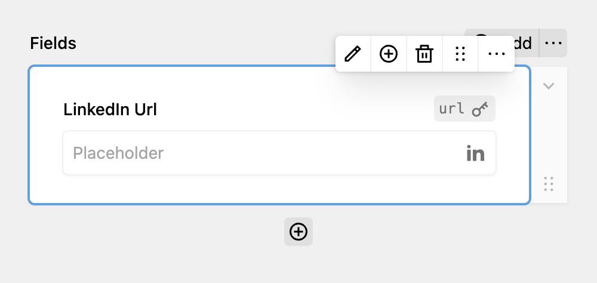

Extending DreamForm by creating custom fields is easy. In this guide, we're creating a custom LinkedIn field. This field validates that the entered content is a valid LinkedIn URL. If you don't know what a field is yet, check out ["What are fields?"](https://plugins.andkindness.com/dreamform/docs/fields/what-are-fields).

## When to choose a field

* You want to collect certain data from your users
* You want to customize the validation behaviour of an existing field
* The collected data should be stored in the submission
* You want to give your users the freedom to place the field anywhere they want
* You want panel controls for your field

## Creating the plugin

In DreamForm, every field is a class. In theory, you don't have to create a Kirby plugin as long as the field class is loaded correctly. But since Kirby autoloads plugins and they can also be used to share fields between projects, we're using a plugin here.

Create a new folder in `site/plugins` called `linkedin-field` and add an `index.php` file. In this file, define your plugin as you would normally do:

```php
// site/plugins/linkedin-field/index.php

use Kirby\Cms\App as Kirby;

Kirby::plugin('tobimori/linkedin-field', []);
```

## The field class

Let's create a new file for our class, `LinkedinField.php`. A basic field class only needs the following methods:

* `public static function blueprint(): array`   
  Returns an array with the blueprint definition used in the panel
* `public static function type(): string`  
  Returns the type of the field used internally, also used for accessing the snippet

**However, we want to customize our field a bit more, adding a custom validation & a submission preview.** DreamForm provides the following additional methods for that.

* `public function validate(): true|string`   
  Validates the field value (`$this->value()`), returns the error message as string or true if the validation was successful
* `protected function sanitize(\Kirby\Content\Field $field): \Kirby\Content\Field`  
  Returns the sanitized field value
* `public function afterSubmit(SubmissionPage $submission): void`   
  Run logic after the submission, such as uploading files
* `public function submissionBlueprint(): array|null`   
  Returns an array with the blueprint definition used when viewing a submission
* `public static function isAvailable(FormPage|null $form = null): bool`  
  Whether the field should be available, used for checking global configuration details, like API keys
* `public static function group(): string`   
  Customize the group of the field in the panel
* `public static function hasValue(): bool`   
  Whether the field stores a value or is entirely cosmetic (like a heading)

Okay, that was a lot, let's get back to the basics. We can start with the following, defining the `blueprint()` and the `type()` of the field.

```php
<?php

use tobimori\DreamForm\Fields\Field;

class LinkedInField extends Field
{
  public static function blueprint(): array
  {
    return [
      'title' => 'LinkedIn',
      'label' => '{{ label }}',
      'preview' => 'text-field',
      'wysiwyg' => true,
      'icon' => 'linkedin',
      'tabs' => [
        'field' => [
          'label' => t('dreamform.field'),
          'fields' => [
            'key' => 'dreamform/fields/key',
            'label' => 'dreamform/fields/label',
            'placeholder' => 'dreamform/fields/placeholder',
          ]
        ],
        'validation' => [
          'label' => t('dreamform.validation'),
          'fields' => [
            'required' => 'dreamform/fields/required',
            'errorMessage' => 'dreamform/fields/error-message',
          ]
        ]
      ]
    ];
  }

  public static function type(): string
  {
    return 'linkedin';
  }
}
```

After that, let's create a new snippet in `snippets/linkedin.php` - this is where we define the snippet for our input. Since our LinkedIn field should look and feel the same as the normal text field, we're simply gonna re-use this snippet here and set the type to "url", so that the OS input methods can adjust to the field.

```php
<?php

/**
 * @var \tobimori\DreamForm\Models\Submission|null $submission
 *
 * @var \Kirby\Cms\Block $block
 * @var \tobimori\DreamForm\Fields\NumberField $field
 * @var \tobimori\DreamForm\Models\FormPage $form
 * @var array $attr
 */

snippet('dreamform/fields/text', [
  'block' => $block,
  'field' => $field,
  'form' => $form,
  'attr' => $attr,
  'type' => 'url'
]);
```

## Registering and enabling the field

Go back to your `index.php` file. We now have to tell DreamForm that our LinkedIn field exists, and we can do so using the register function.

```php
// [...]

@include_once __DIR__ . '/LinkedInField.php'; // Tell PHP to load our class

DreamForm::register(LinkedInField::class); // Register the class with DreamForm

Kirby::plugin('tobimori/linkedin-field', [
  'snippets' => [
    'dreamform/fields/linkedin' => __DIR__ . '/snippets/linkedin.php' // Register the field snippet with Kirby
  ]
]);
```

DreamForm automatically uses the type returned by `type()` for accessing the snippet. You should now be able to see the field available in your panel. Add it to an example form and let's see how it looks in the frontend.



## Validating the field

Our LinkedIn field works now, but it behaves like a normal text field. Users can enter everything, and there will be no validation. Let's extend our `LinkedInField.php` to add that!

```php
class LinkedInField extends Field
{
  [...]

  public function validate(): true|string
  {
    if (
      // If the field is required, check if it's empty
      $this->block()->required()->toBool()
      && $this->value()->isEmpty() ||
      // Regex match to check if the value is a valid LinkedIn URL
      // https://stackoverflow.com/a/33760587/12168767
      $this->value()->isNotEmpty() &&
      !Str::match($this->value(), "/http(s)?:\/\/([\w]+\.)?linkedin\.com\/in\/[A-z0-9_-]+\/?/")
    ) {
      return $this->errorMessage();
    }

    return true;
  }
}
```

If the field is marked as required, we need to ensure that it is not left empty by the user. Additionally, when the field is filled with a value, we must validate that the entered value is a valid LinkedIn URL.

## Finishing touches

In order to view the submitted URL in the panel as well, we're gonna add an submission blueprint to the class. I'm also not happy that the field is just shown at the end of the "common fields" in the block selector, so I'm gonna add an new group.

```php
class LinkedInField extends Field
{
  [...]

  public function submissionBlueprint(): array|null
  {
    return [
      'label' => $this->block()->label()->value() ?? 'LinkedIn',
      'icon' => 'linkedin',
      'type' => 'text'
    ];
  }

  public static function group(): string
  {
    return 'social';
  }
}
```

Now you're done and you've created an entirely new field! If you need more inspiration, take a look at the source code of the built-in fields of DreamForm.