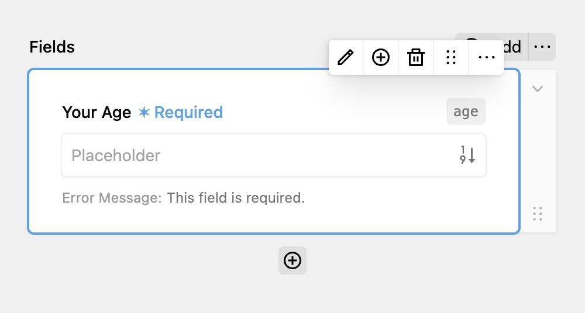

The number field is used for accepting numbers or decimals as answer. It maps to a `<input type="number">` input.

When clicking on the Edit icon, you can additionally set **a step size**. This step size is used when clicking on the Up & Down buttons provided by the browser as well as validation for a common denominator for the input. To allow entiring decimal numbers like 1.5, your step size would have to be decimal as well, like 0.5.

When switching to the validation tab, you can additionally set a **minimum and maximum value.** If the entered number is below the minimum or exceeds the maximum, the error message is shown to the user.