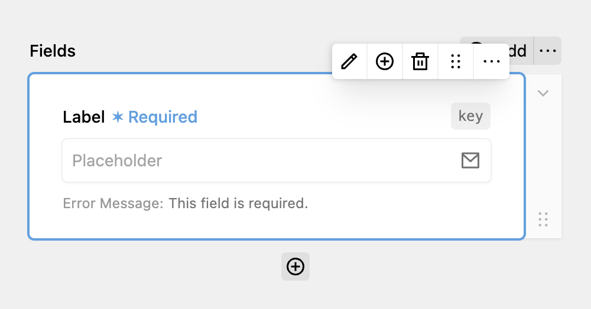

The Email field allows you to capture email addresses and validate them. It maps to a `<input type="email">` element. It is safe to use user-filled email fields to get the recipient inside an Email action.

The Email field has the same options as a normal text field: Setting the Key, a Label and the Placeholder. Under the validation tab, you can also mark the field as required and add a custom error message. This error message will also be shown if **the email is in an invalid format.**