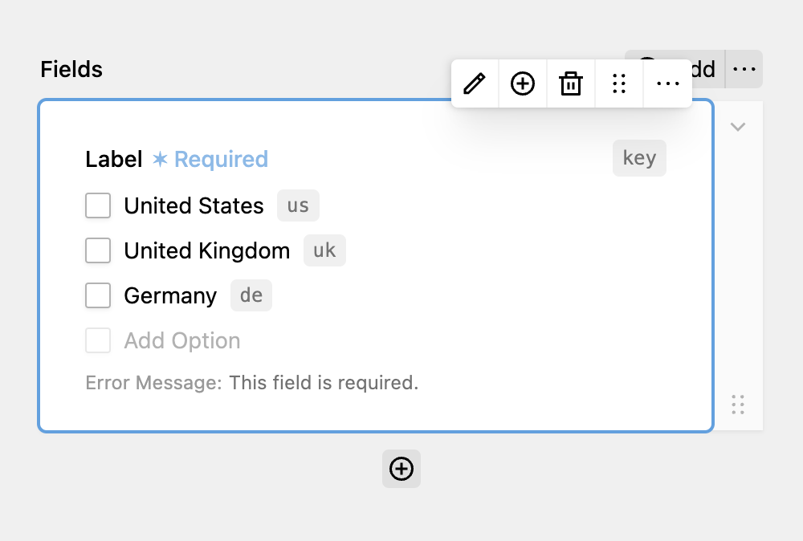

Checkboxes allow users to select one or many entries from a collection of choices. Each choice can have their own value and label. Values are stored separated by comma.

Unlike other fields, the label of the checkboxes field itself is optional. It can be used as a heading for all available options.

Checkboxes also allow you to set a minimum and maximum number of selected choices and a custom error message that will be shown if the criteria are not met.

Each option map to a `<input type="checkbox">` element.