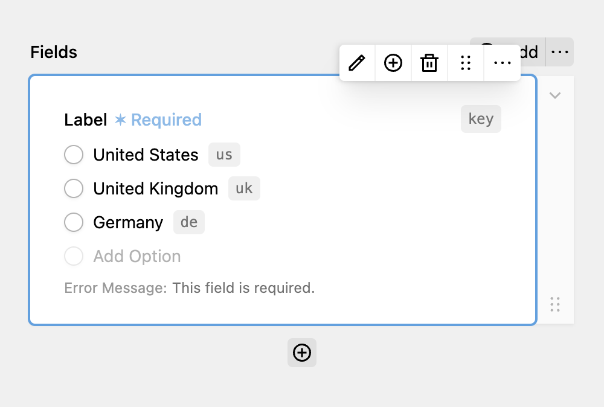

Radio Buttons allow users to select exactly one entry from a collection of choices. Each choice can have their own value and label. Values are stored separated by comma.

While the field does not have to be required and can be entirely optional, it is not possible to deselect a radio button after it has clicked due to a browser limitation. In case this is a hard requirement for you, you should try using a Checkboxes field instead and set the maximum number of selected choices to one.

Unlike other fields, the label of the radio buttons field itself is optional. It can be used as a heading for all available options.

Each option map to a `<input type="radio">` element.