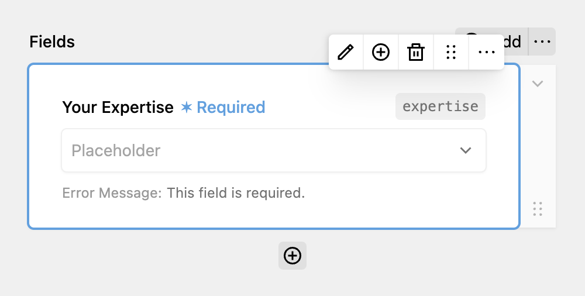

The Pages Dropdown automatically populates a dropdown with a selection of Kirby pages or the listed children of these pages.

Besides the normal options a [dropdown field](https://plugins.andkindness.com/dreamform/docs/fields/select) has, like label, key & placeholder, clicking on the edit button opens the sidebar where you can select pages to be shown in the dropdown. Alternatively, you can click the toggle and use the listed children of these pages instead.