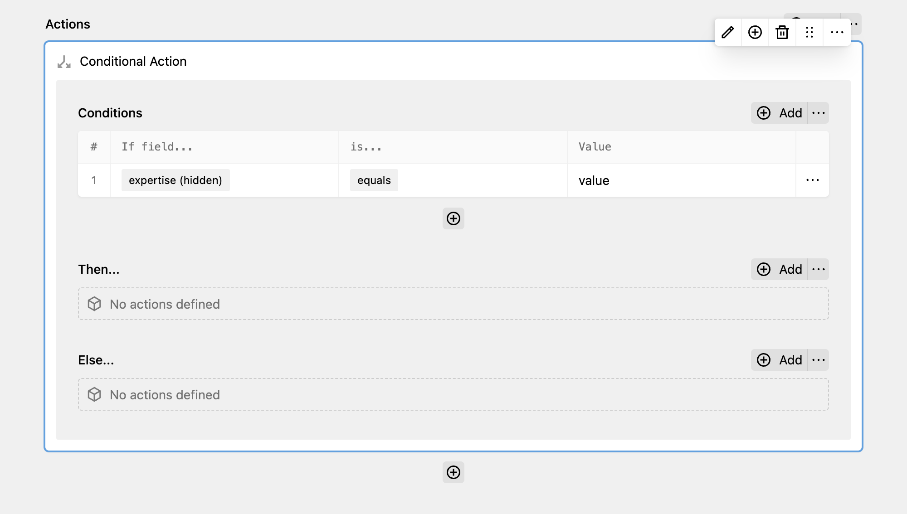

The conditional action allows you to check the values of certain fields. You can compare any field against a value by using one of the following types of conditions:

* `equals`
* `not equals`
* `contains`
* `not contains`
* `starts with`
* `ends with`

All conditions specified in the "Conditions" field of the action must match in order for the nested actions to be executed.

Due to a limitation in Kirby, it is not possible to nest conditional actions inside conditional actions.