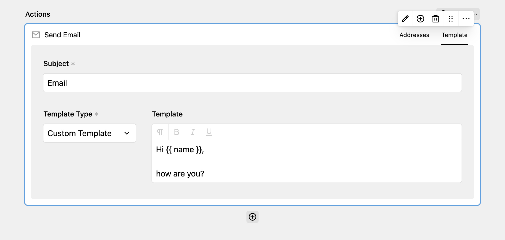

Using the email action, you can send email from the configured SMTP credentials of your Kirby installation to anyone. You can customize the sent message in the panel or use email templates defined in the code of your Kirby site.

You can use the Kirby Query Language and field names inside your **"Custom Template"** emails. A field with the key `name` would be available with the placeholder `{{ name }}` in the template.

The Default template will render all fields from the Email in a neatly formatted HTML email template that's included with DreamForm.