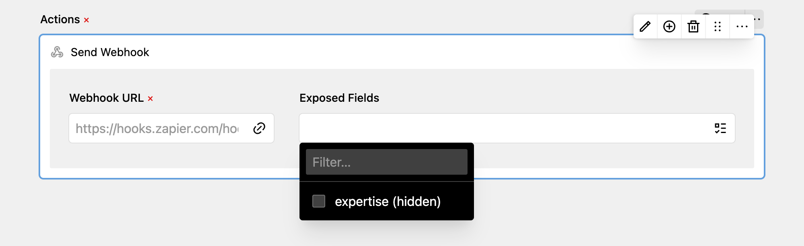

The webhook action can be used to connect with third-party services like Zapier, n8n.io, Make.com, Integretomat or others. This way, you can connect DreamForm to any service even if it doesn't offer a integrated action for your use case.

After adding the action, you simply have to add your Webhook URL and select all fields you want to send with the request. The sent JSON object is a key-value object with all selected exposed fields.

If no fields are selected, all fields are sent with the request. Make sure to test each form you're using a webhook action.