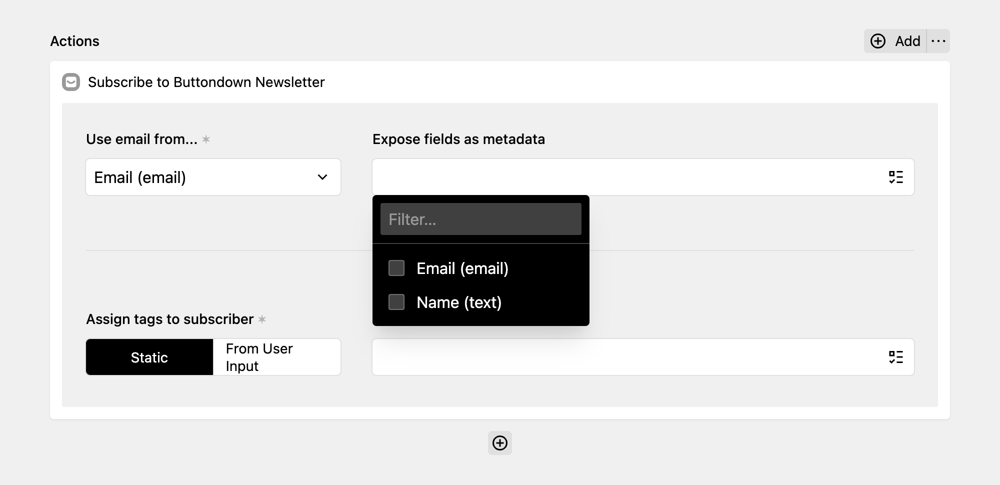

[Buttondown](https://buttondown.email/) is a "newsletter software for people like you", and uses Markdown to write newsletters.

With the Buttondown action, you can integrate DreamForm with the Buttondown API and let senders subscribe to a Buttondown newsletter.

This action uses the Buttondown API which requires a **Basic subscription** to Buttondown.

## Get started

Grab your API key from your Buttondown account. Simply click on "API Requests" in the sidebar and press `K`. Proceed by adding the API key to your `config.php` file.

```php
// site/config/config.php

return [
  'tobimori.dreamform' => [
    'actions' => [
      'buttondown.apiKey' => fn () => env('BUTTONDOWN_API_KEY')
    ],
  ],
];
```

Ideally, you should not commit this key to your repository, but instead load it from an environment variable, e.g. using the [kirby-dotenv plugin by Bruno Meilick](https://github.com/bnomei/kirby3-dotenv), as shown in the example above.

| Option | Default | Accepts | Description |
| --- | --- | --- | --- |
| tobimori.dreamform.fields.buttondown.apiKey | `null` | `string|callback` | The API key to communicate with Buttondown |
| tobimori.dreamform.fields.buttondown.simpleMode | `false` | `boolean` | Simple mode works with the free tier, but does not support updating user data or tags |

## Adding the action to your form

If the API key is specified and working, the action will show up in the select screen. Add it and select **the field that is used to input the email** which will be subscribed.

Additionally, you can select other fields that should be added as JSON metadata to the subscriber. The key in Buttondown will be the same as in your form.

You can also assign tags to your subscribers, either by picking them from a static list, or by getting the value from a field. You can also assign multiple tags dynamically, e.g. using a checkboxes field.

