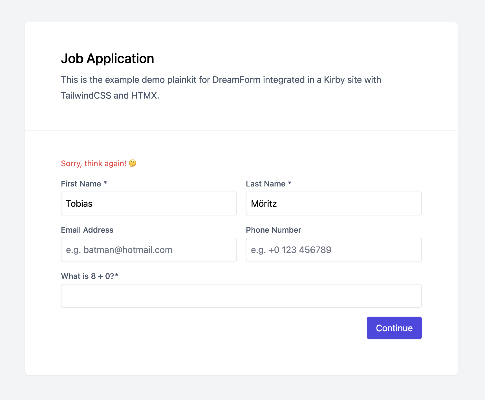

Similar to fields & actions, you can create custom guards. In this guide, we're creating a Calc guard. This guard expects the user to solve a simple math problem (like 3+9) successfully to proceed with a submission. If you don't know what a guard is yet, check out ["What are guards?"](0_what-are-guards.md).

## When to choose a guard (or not)

You should choose a guard, if the following criteria are met:

* Your code is meant to **cancel the submission** and show an error message if certain criteria are met
* It's important that your certain action runs **before anything else**
* You want something to be added to or run **on every form**
* You don't want or **need panel controls** or settings
* You don't need **to control the placement** of the related template code

If any of those is a deal-breaker for you, you might be better off with a [field](../2_fields/12_custom.md) or [action](../3_actions/8_custom.md).

## Creating the plugin

In DreamForm, every guard is a class. In theory, you don't have to create a Kirby plugin as long as the guard class is loaded correctly. But since Kirby autoloads plugins and they can also be used to share guards between projects, we're using a plugin here.

Create a new folder in `site/plugins` called `calc-guard` and add an `index.php` file. In this file, define your plugin as you would normally do:

```php
// site/plugins/calc-guard/index.php

use Kirby\Cms\App as Kirby;

Kirby::plugin('tobimori/calc-guard', []);
```

We're coming back to this later.

## The guard class

Let's create a new file for our class, `CalcGuard.php`. A basic guard class only needs a `run()` function that will be executed when the guard is evaluated and the **static** functions `hasSnippet()` and `type()`. We'll start with the following contents:

```php
// site/plugins/calc-guard/CalcGuard.php

use tobimori\DreamForm\Guards\Guard;

class CalcGuard extends Guard
{
  public function run()
  {
    // $this->cancel('error message!');
  }

  public static function hasSnippet(): bool
  {
    return true;
  }

  public static function type(): string
  {
    return 'calc';
  }
}
```

`hasSnippet()` should return a `boolean` that is used by the form snippet to determine whether the guard needs some kind of HTML snippet to output. If `true`, the guard snippet with the same `type()` will be rendered.

`type()` returns a the name of the guard. This is used in the `config.php` file to enable or disable a guard.

In addition to that, guards can also have a static `isAvailable()` method that returns a `boolean`. Since we don't have any dynamic options that would require use to disable the guard if not set, we're omitting this function and it will default to `true`.

## Building the logic

Before validation, we need a method to generate a math question and store the result for later use. Let's create a new function `generate()` that does so:

```php
public function generate(): string
{
  [$a, $b] = [rand(0, 9), rand(0, 9)]; // Generate two random numbers
  App::instance()->session()->set('calc-guard-result', $a + $b); // Store the result in a session

  return "What is {$a} + {$b}?"; // Return the question as string
}
```

In our `run()` method, we're accessing the result, check if the submitted value is correct, and if not cancel the submission.

```php
public function run()
{
  $result = App::instance()->session()->pull('calc-guard-result'); // Get result from session, and remove it
  $value = SubmissionPage::valueFromBody('calc'); // Get Field value

  // Check if the value doesn't exists or is not equal to the result
  if (empty($value) || $result !== (int) $value) {
    $this->cancel('Sorry, think again! 🤔');
  }
}
```

In this method, we're using the `SubmissionPage::valueFromBody()` static function to get the submitted value from the request directly. This is different from Fields since submission values aren't stored yet in the lifecycle of when guard is ran.

Your final `CalcGuard` class should look like this:

```php
<?php

use Kirby\Cms\App;
use tobimori\DreamForm\Guards\Guard;
use tobimori\DreamForm\Models\SubmissionPage;

class CalcGuard extends Guard
{
  public function run()
  {
    $result = App::instance()->session()->pull('calc-guard-result');
    $value = SubmissionPage::valueFromBody('calc');

    if ($result !== (int) $value) {
      $this->cancel('Sorry, think again! 🤔');
    }
  }

  public static function hasSnippet(): bool
  {
    return true;
  }

  public static function type(): string
  {
    return 'calc';
  }

  public function generate(): string
  {
    [$a, $b] = [rand(0, 9), rand(0, 9)];
    App::instance()->session()->set('calc-guard-result', $a + $b);

    return "What is {$a} + {$b}?";
  }
}
```

## Creating the snippet

Since users need a field to type the result into, we have to create a snippet for that. It's important to keep in mind that guard snippets are always output **just before the last button** on a form page.

Create a new file called `calc.php` inside `/site/plugins/calc-guard/snippets`.

```php
// site/plugins/calc-guard/snippets/calc.php

<div <?= attr($attr['field']) ?>> <?php /* $attr includes the classes apply to the fields */ ?>
  <label <?= attr(A::merge($attr['label'], ["for" => "calc"])) ?>>
    <span><?= $guard->generate() ?></span><em>*</em> <?php /* Generate the result and show the question */ ?>
  </label>
  
  <input <?= attr(A::merge($attr['input'], [
    'type' => 'number',
    'id' => 'calc',
    'name' => 'calc',
    'required' => true
  ])) ?>>
</div>
```

## Registering and enabling the guard & snippet

Go back to your `index.php` file. We now have to tell DreamForm that our Calc guard exists, and we can do so using the register function.

```php
// [...]

@include_once __DIR__ . '/CalcGuard.php'; // Tell PHP to load our class

DreamForm::register(CalcGuard::class); // Register the class with DreamForm

Kirby::plugin('tobimori/calc-guard', [
  'snippets' => [
    'dreamform/guards/calc' => __DIR__ . '/snippets/calc.php' // Register the Guard snippet with Kirby
  ]
]);
```

DreamForm automatically uses the type returned by `type()`, and we can use that to enable the guard in our `config.php` file.

```php
// site/config/config.php

return [
  'tobimori.dreamform.guards' => [
    'available' => ['calc', 'csrf', 'honeypot'],
  ]
];
```

## Testing your form

Your form should now correctly render the calc input before the button Field. Let's test it and see if it works!



Congrats, you've created your first guard! If you think it's useful to others, consider publishing it as a Kirby plugin.