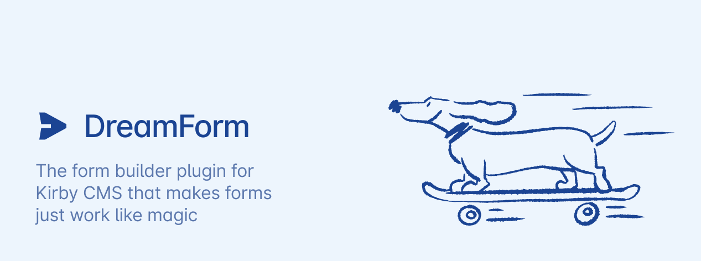

# Kirby DreamForm

DreamForm is an opiniated form builder plugin for [Kirby CMS](https://getkirby.com/) that makes forms work like magic.

---

Create powerful single or multi-step forms with a Layout builder directly inside your panel. Create complex submission behaviour workflows with actions. DreamForm supports numerous built-in fieldtypes & actions, but can be expanded and customized as easily as Kirby itself.

Read more about DreamForm on the [official plugin website](https://plugins.andkindness.com/dreamform).

## License

Kirby DreamForm is not free software. In order to run it on a public server, you'll have to purchase a valid Kirby license & a [valid DreamForm license](https://plugins.andkindness.com/dreamform/pricing).

Copyright 2024-2026 © Tobias Möritz - Love & Kindness GmbH

---

The plugins' name is a homage to Kirby's Dream Land.
